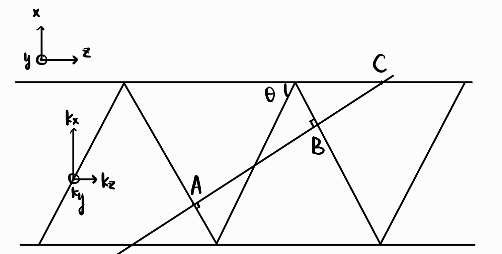

4. Consider an infinitely long cylinder of radius $R$, permanently polarized with polarization $\textbf{P} = \alpha \textbf{r}$, where $\textbf{r}$ is the radial vector. The cylinder rotates about its axis with angular velocity $\omega$, where $\omega R \ll c$. Neglect all relativistic effects.
   
   (a) Calculate the electric field $\textbf{E}$ and the magnetic field $\textbf{B}$ both inside and outside the cylinder.

   (b) Determine the electromagnetic energy per unit length of the cylinder.

5. A plane divides space into two regions: one filled with a dielectric of dielectric constant $\epsilon_1$ and the other with dielectric constant $\epsilon_2$. In the $\epsilon_1$ region, a point charge $Q$ is placed at a distance $d$ from the plane.

   (a) For $\epsilon_1 = \epsilon_0$ (vacuum) and $\epsilon_2 = \infty$ (perfect conductor), find the surface charge density distribution on the plane.

   (b) For arbitrary $\epsilon_1$ and $\epsilon_2$, find the surface charge density distribution on the plane.

   (c) Compare the results of (a) and (b), and derive the electric field in the entire space for case (b).

6. Consider a cavity resonator of size $a \times a \times b$ along the $x$, $y$, and $z$ axes, respectively. The boundary of the resonator is a perfect conductor, except for the $z=0$ plane, which has a finite conductivity $\sigma_s$. Assume the imperfection does not affect the electromagnetic field distribution inside the resonator. Consider the $TM_{110}$ mode.

   The quality factor of the resonator is defined as
   $$Q = \frac{2\pi f W_{tot}}{P_{dis}},$$
   where $f$ is the frequency of the mode, $W_{tot}$ is the total energy stored in the resonator, and $P_{dis}$ is the power dissipation rate.

   (a) Calculate $W_{tot}$ for the resonator. (Hint: The total energy of the electric field is equal to the total energy of the magnetic field.)

   (b) Given the equation for the energy dissipation rate of a surface,
   $$P_{dis} = \frac{1}{2} \int_{S} \frac{|\alpha|^2}{\sigma_s} dS,$$
   where $\alpha$ is the electric current density on the surface, calculate $P_{dis}$ for the resonator.

7. Consider a square waveguide made of an ideal conductor with side length $L$. The axis is along the $z$ direction. We focus on the modes where 

   $$E_x = E_0 \sin\left(\frac{m\pi y}{L}\right) \sin(kz - \omega t),$$ 

   with $E_y = E_z = 0$, and $B$ is perpendicular to $E$, implying $B_z = 0$.

   (a) Derive the dispersion relation $\omega(k)$ for this mode, which describes the relationship between $\omega$ and $k$.

   (b) Calculate $B_y$ and $B_z$ for this mode. Determine the surface charge density and surface current density on the waveguide walls using the boundary conditions.

   (c) Suppose the waveguide is cut into two halves along the $y = \frac{L}{2}$ plane, where the halves remain adjacent but unconnected, preventing any surface current across the cut. Derive the new dispersion relation $\omega'(k)$. If the waveguide is cut along the $x = \frac{L}{2}$ plane instead, what are the allowed modes?

8. Consider a square waveguide with side length $L$. The axis is along the $z$ direction. We consider all TE and TM modes in the waveguide.

   (a) Calculate the possible $k_x$ and $k_y$ values for the modes and derive the dispersion relation $\omega(k_z)$.

   (b) We use another method to understand the modes in the waveguide. Figure 1 shows a cross-section of the waveguide perpendicular to the $y$-axis. A plane wave with wavevector $\vec{k} = (k_x, k_y, k_z)$ propagates in the waveguide and reflects off the walls. A wave is allowed only if points $A$ and $B$ in the figure are in the same phase ($\phi_B = \phi_A + 2m\pi$).

   - Calculate the allowed $k_x$ and $k_y$ values for the plane wave (_hint:_ use $\text{d}\phi = \vec{k} \cdot \text{d}\vec{l}$).
   - Determine the speed of the plane wave $v_g$ in the waveguide and the speed of point $C$, $v$. ($C$ is the intersection of the wavefront and the wall) $v$.
   - These speeds correspond to the group speed and phase speed of the wave, respectively. Use the dispersion relation from (a) to calculate $v_g = \frac{\text{d}\omega}{\text{d}k_z}$ and $v = \frac{\omega}{k_z}$.

   