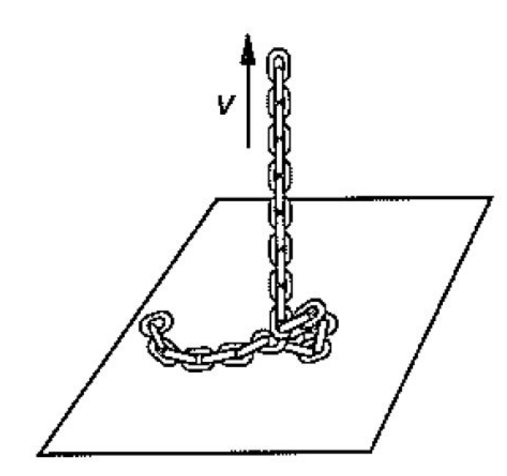
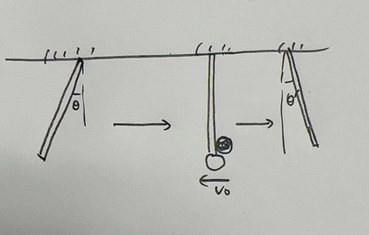

# General Physics 2024 Spring Midterm
## General Informations
- **Date**: 2024-04-22
- **Time**: 9:50-12:20
- **Calculater is allowed.**
- **Closed book.**
- **Total points**: 110 (including 10 bonus points)

*side note.* All *side notes* doesn't appear on the real exam paper. However, the **Hints** do. Moreover, some problems may not be described very clearly, but it is similar to the descriptions appeared on the real exam.

## Problem 1 (5 pts)

**This is a multiple choice question.**

A smooth horizontal table has a small hole with a negligible size. A massless rope passes through the hole, pulling a particle moving in a circular motion at constant speed with a force $F$. We gently adjust $F$ so that the length of the rope on the table slowly increases. Since the change is so slow, we can assume that the particle is always moving in a circular motion at every moment, so the force on the particle is perpendicular to its velocity. Then, in the process of increasing the radius of circular motion from $r$ to $2r$:

A. The kinetic energy of the particle increases;   
B. The kinetic energy of the particle decreases;   
C. The kinetic energy of the particle remains the same;    
D. None of above.

## Problem 2 (5 pts)
A string is stretched between two fixed pillars. It has a length of $l=0.8\text m$ and a mass of $m=4.5\text g$, and is under a tension of $\tau=484\text N$. Determine which of the following frequencies are possible for the standing waves on this string. Select all that apply:

A. $275\text{ Hz}$;   
B. $367\text{ Hz}$;  
C. $825\text{ Hz}$;  
D. $1100\text{ Hz}$.

## Problem 3 (5 pts)
A block of mass $m$ is placed on the ground. The friction coefficient between the block and the ground is $\mu$. Now, we want to pull the block to make it move by applying a force with angle $\theta$ between the ground, as shown in the figure. Find out the $\theta$ that minimizes the force needed to make the block moves.

## Problem 4 (10 pts)
The end of a chain, of mass per unit length $\mu$, at rest on a table top at $t=0$, is lifted vertically at a constant speed $v$, as shown in the figure. Evaluate the upward lifting force $F$ as a function of time.

*side note:* this problem comes from homework.

## Problem 5 (10 pts)
A police car with a siren emitting a sound at frequency $f_0$ is moving at a speed $v_s$ towards a stationary wall. The speed of sound in air is $c$. Assume the siren's sound reflects off the wall and is heard by an observer in the police car. Calculate the frequency of the sound that the observer hears after it reflects off the wall.

## Problem 6 (10 pts)

We demonstrate the elastic collision of identical balls during the class. The experimental equipment is too old so the string loosens. Now the line connecting the center of the two balls is not perpendicular to the string but has an angle $\theta$ as shown in the figure. Both balls have mass $m$. The ball on the left moves with velocity $v$ and collides with the other ball. The collision is elastic. Assume the impulse between the two balls. Calculate the energy loss during the collision.

**Hint**. Analyze the two-dimensional collision first, and then the downward velocity along the string is removed.

## Problem 7 (10 pts)
As shown in the figure, a stick of length $l$ with particles $A$ and $B$ of both mass $m$ at both ends rotates around its midpoint $O$ with a constant angular velocity $\vec\omega$. The angle between $\vec\omega$ and the stick is $\theta$. 

1. Assume the stick itself is massless. Calculate the angular momentum about $O$ and the kinetic energy of the system.
2. Assume the stick is uniform of mass $M$. Calculate the angular momentum about $O$ and the kinetic energy of the system. What torque about $O$ should be applied in order to keep the system rotating?

## Problem 8 (10 pts)

We know that a rod swinging about one end forms a physical pendulum. A rod with mass $M$, length $l$, and uniform mass distribution is initially displaced to the left side by angle $\theta$, where $\theta \ll 1$, as shown in the figure. When the rod is at its vertical position swinging to the right, a ball with mass $m$ hits the lower end of the rod. The instant before hitting the rod, the ball has a velocity $\vec v_0$ with a direction straight to the left, as shown in the figure. After the collision, the ball attaches to the rod, and swings to the right. Then we obtain a new pendulum as shown in the figure. Assume that the radius of the ball is much smaller than the length of the rod.

1. Calculate the maximal angular displacement $\theta'$ of the new pendulum after the collision.
2. Calculate the period $T'$ of the new pendulum after the collision.

## Problem 9 (15 pts)

A horizontal disk with radius $R$ is rotating with a constant angular velocity $\omega$, and a slide is fixed along the diameter of the disk with both ends blocked. A massless spring has its one end fixed at an endpoint of the slide, and its other end can move along the slide. The spring has constant $k$ and natural length $R/3$. Now, a block with mass $m$ is placed at a distance $R/3$ from the disk's center without initial speed, as shown in the figure. Assume that all surfaces are frictionless, the size of the block is much smaller than the disk radius, and the spring can be suppressed to zero length. 

1. Try to represent the minimum tension constant $k_{\min}$ by $m,\omega$ and $R$, such that the block will stop before hitting the end of the slide.
2. For the following questions, consider the case when $k=k_{\min}$. What is the period of the block's motion? Is the block doing a simple harmonic oscillation? Explain briefly.
3. Throughout the entire motion, what is the maximal magnitude of the overall supporting force exerted on the block?

**Hint**. Consider supporting force on all surfaces.

## Problem 10 (10 pts)
A stick of mass $m$ and length $2r$ lies on a half cylinder of the same mass $m$ and radius $r$ as shown in the figure. All the contacts among the objects and the ground are frictionless. The system starts stationary at $\theta=30^\circ$. Now the stick begins to slide down the half cylinder. Calculate the velocity of the half cylinder when the relative position of the two objects reaches $\theta=60^\circ$.

## Problem 11 (10 pts)

Due to Earth's rotation, objects in free fall do not follow a strictly vertical trajectory. Consider an object released from a height of $h=90\text m$ at a northern latitude of $\phi=45^\circ$. Calculate the deviation in the object's landing position caused by the rotation of the Earth.

The radius of the earth is $6371\text{ km}$, the gravitational acceleration is $g=10\text{ m/s}^2$, and the angular velocity of the earth rotation is $\omega=7\times 10^{-5} \text{ rad/s}$. Ignore the air resistance. Retain the result to the lowest order of $\omega$. What is the magnitude of the offset?

## Problem 12 (Bonus problem, 10 pts)

Light pressure is the mechanical pressure exerted on surfaces due to the exchange of momentum between the object and the electromagnetic field. You can imagine that a light source emits small particles (photons) continuously. The force exerted on a surface arises from the momentum change of these photons when they strike the surface.

Consider a scenario where a light source is positioned inside a thin spherical shell with radius $R$. The light source is placed at a distance $l$ from the center $O$ of the sphere, where $l\ll R$, as illustrated in the figure. The inner surface of the sphere is a perfect black body, absorbing all incident light. Assume that the source emits $n\gg 1$ photons per second homogeneously in all directions and each photon has momentum of $p_0$. We will examine the effects of light pressure under these conditions.

1. Both the light source and the sphere are initially at rest and can move freely. The light is initially off. Describe the movement of the light source and the sphere after the light is turned on.
2. Initially, the light is on, and the sphere is fixed in place. Describe the motion of the sphere after it is allowed to move freely.

